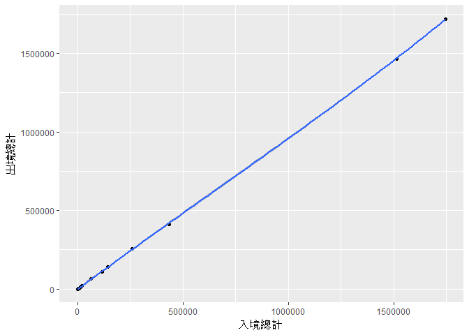

國內各港口/機場使用率評估
================

作業說明 （繳交時請直接刪除這個章節）
-------------------------------------

作業目的：期末專題暖身

依下列指示，完成期末分析專題作業規劃：

-   訂出分析問題，並將R Markdown的一級標題(第一行的title:)中的"長庚大學 大數據分析方法 作業六"取代為期末專題的分析問題，並在分析議題背景前加上組員姓名 (`10pt`)
-   分析議題背景 (`10pt`) 與動機 (`10pt`)
-   資料說明 (`10pt`) 與 載入 (`10pt`)
-   資料處理與清洗 (`10pt`) 說明 (`10pt`)
-   對資料們進行探索式資料分析，圖文並茂佳!(`20pt`)
-   期末專題分析規劃與假設 (`10pt`)

分析議題背景
------------

B0344218 葉建夆 B0344117 沈庭安 台灣本島、離島的港口/機場共有32個，每一座都是耗資鉅款來建造的。有的是為了進出口買賣、有的是為了人口出入境；但真的有必要蓋到這麼多個嗎?甚至有的縣市還有兩座，這些機場/港口的存在是否有必要呢?

隨著機場捷運的通車，替不少出入機場的公民帶來便利，然而機場捷運的通車後，是否有影響到桃園機場的人數流量呢?

當我們今天從桃園機場出境，我們一樣會從桃園機場入境嗎?機場的出境入境是否呈現正相關?

我們藉由分析三個月份的機場港口/出入境人數，來分析以上的議題。

分析動機
--------

了解各機場及港口出入境的使用率，並觀察: 1.那些機場/港口的人數流量最高/低 2.機場捷運通車後是否有影響桃園機場的人數流量 3.機場/港口出入境人數是否有相關性

使用資料
--------

內政部2017年2月(X1060228)、3月(X1060331)和4月(X1060430)各港口及機場的出入境人數量

載入使用資料們

``` r
library(readr)
```

    ## Warning: package 'readr' was built under R version 3.3.3

``` r
X10602 <- read_csv("C:/Users/pig98/Desktop/1060228.csv",skip=1)
```

    ## Warning: Missing column names filled in: 'X4' [4], 'X5' [5], 'X7' [7],
    ## 'X8' [8], 'X11' [11], 'X12' [12], 'X14' [14], 'X15' [15], 'X17' [17],
    ## 'X18' [18], 'X20' [20], 'X21' [21], 'X23' [23], 'X24' [24], 'X26' [26],
    ## 'X27' [27], 'X29' [29], 'X30' [30], 'X32' [32], 'X33' [33], 'X35' [35],
    ## 'X36' [36], 'X38' [38], 'X39' [39], 'X41' [41], 'X42' [42], 'X44' [44],
    ## 'X45' [45], 'X47' [47], 'X48' [48], 'X50' [50], 'X51' [51], 'X53' [53],
    ## 'X54' [54], 'X56' [56], 'X57' [57], 'X59' [59], 'X60' [60], 'X62' [62],
    ## 'X63' [63], 'X65' [65], 'X66' [66], 'X68' [68], 'X69' [69], 'X71' [71],
    ## 'X72' [72], 'X74' [74], 'X75' [75], 'X77' [77], 'X78' [78], 'X80' [80],
    ## 'X81' [81], 'X83' [83], 'X84' [84], 'X86' [86], 'X87' [87], 'X89' [89],
    ## 'X90' [90], 'X92' [92], 'X93' [93], 'X95' [95], 'X96' [96], 'X98' [98],
    ## 'X99' [99], 'X100' [100]

    ## Parsed with column specification:
    ## cols(
    ##   .default = col_character(),
    ##   `入出境總人數(小計)` = col_integer()
    ## )

    ## See spec(...) for full column specifications.

``` r
View(X10602)

X10603 <- read_csv("C:/Users/pig98/Desktop/1060331.csv",skip=1)
```

    ## Warning: Missing column names filled in: 'X4' [4], 'X5' [5], 'X7' [7],
    ## 'X8' [8], 'X11' [11], 'X12' [12], 'X14' [14], 'X15' [15], 'X17' [17],
    ## 'X18' [18], 'X20' [20], 'X21' [21], 'X23' [23], 'X24' [24], 'X26' [26],
    ## 'X27' [27], 'X29' [29], 'X30' [30], 'X32' [32], 'X33' [33], 'X35' [35],
    ## 'X36' [36], 'X38' [38], 'X39' [39], 'X41' [41], 'X42' [42], 'X44' [44],
    ## 'X45' [45], 'X47' [47], 'X48' [48], 'X50' [50], 'X51' [51], 'X53' [53],
    ## 'X54' [54], 'X56' [56], 'X57' [57], 'X59' [59], 'X60' [60], 'X62' [62],
    ## 'X63' [63], 'X65' [65], 'X66' [66], 'X68' [68], 'X69' [69], 'X71' [71],
    ## 'X72' [72], 'X74' [74], 'X75' [75], 'X77' [77], 'X78' [78], 'X80' [80],
    ## 'X81' [81], 'X83' [83], 'X84' [84], 'X86' [86], 'X87' [87], 'X89' [89],
    ## 'X90' [90], 'X92' [92], 'X93' [93], 'X95' [95], 'X96' [96], 'X98' [98],
    ## 'X99' [99], 'X100' [100]

    ## Parsed with column specification:
    ## cols(
    ##   .default = col_character(),
    ##   `入出境總人數(小計)` = col_integer()
    ## )
    ## See spec(...) for full column specifications.

``` r
View(X10603)

X10604 <- read_csv("C:/Users/pig98/Desktop/1060430.csv",skip=1)
```

    ## Warning: Missing column names filled in: 'X4' [4], 'X5' [5], 'X7' [7],
    ## 'X8' [8], 'X11' [11], 'X12' [12], 'X14' [14], 'X15' [15], 'X17' [17],
    ## 'X18' [18], 'X20' [20], 'X21' [21], 'X23' [23], 'X24' [24], 'X26' [26],
    ## 'X27' [27], 'X29' [29], 'X30' [30], 'X32' [32], 'X33' [33], 'X35' [35],
    ## 'X36' [36], 'X38' [38], 'X39' [39], 'X41' [41], 'X42' [42], 'X44' [44],
    ## 'X45' [45], 'X47' [47], 'X48' [48], 'X50' [50], 'X51' [51], 'X53' [53],
    ## 'X54' [54], 'X56' [56], 'X57' [57], 'X59' [59], 'X60' [60], 'X62' [62],
    ## 'X63' [63], 'X65' [65], 'X66' [66], 'X68' [68], 'X69' [69], 'X71' [71],
    ## 'X72' [72], 'X74' [74], 'X75' [75], 'X77' [77], 'X78' [78], 'X80' [80],
    ## 'X81' [81], 'X83' [83], 'X84' [84], 'X86' [86], 'X87' [87], 'X89' [89],
    ## 'X90' [90], 'X92' [92], 'X93' [93], 'X95' [95], 'X96' [96], 'X98' [98],
    ## 'X99' [99], 'X100' [100]

    ## Parsed with column specification:
    ## cols(
    ##   .default = col_character(),
    ##   `入出境總人數(小計)` = col_integer()
    ## )
    ## See spec(...) for full column specifications.

``` r
View(X10604)
```

資料處理與清洗
--------------

step1:先將多餘的欄、列刪除，以便合併資料框 step2:將三、四個月的資料框合併成同一個(二月資料獨立觀察，因此不合併) step3:將系統自動填入的欄位名稱重新命名為相對應的機場港口名稱 step4:由於桃園機場並不符合迴圈規則，因此獨立操作 step5:刪掉多餘的第一列，並將所有資料轉為numeric型態(原本為charactor)

處理資料

``` r
X10602<-X10602[-c(30,31,32),-100]
X10603<-X10603[-c(2,34,35,36),-100]
X10604<-X10604[-c(32,33,34),-100] #step1

X10603_04<-rbind(X10603,X10604[-c(1,2),])
View(X10603_04) #step2

for(i in c(10:97)){
  if((i %% 3) ==1){
      names(X10602)[c(i+2)]<-paste0(names(X10602)[i],X10602[1,i+2])
      names(X10602)[c(i+1)]<-paste0(names(X10602)[i],X10602[1,i+1])
      names(X10602)[c(i)]<-paste0(names(X10602)[i],X10602[1,i])
    
      names(X10603_04)[c(i+2)]<-paste0(names(X10603_04)[i],X10603_04[1,i+2])
      names(X10603_04)[c(i+1)]<-paste0(names(X10603_04)[i],X10603_04[1,i+1])
      names(X10603_04)[c(i)]<-paste0(names(X10603_04)[i],X10603_04[1,i])
  }
} #step3

for(i in c(1:6))
{
  if(i%%3==0)
  {    
    names(X10602)[c(i+2)]<-paste0(names(X10602)[i],X10602[1,i+2])
    names(X10602)[c(i+1)]<-paste0(names(X10602)[i],X10602[1,i+1])
    names(X10602)[c(i)]<-paste0(names(X10602)[i],X10602[1,i])
    
    names(X10603_04)[c(i+2)]<-paste0(names(X10603_04)[i],X10603_04[1,i+2])
    names(X10603_04)[c(i+1)]<-paste0(names(X10603_04)[i],X10603_04[1,i+1])
    names(X10603_04)[c(i)]<-paste0(names(X10603_04)[i],X10603_04[1,i])
  }
} #step4

X10602<-data.frame(lapply(X10602[-1,], function(x) as.numeric(as.character(x))))
X10603_04<-data.frame(lapply(X10603_04[-1,], function(x) as.numeric(as.character(x)))) #step5
```

探索式資料分析
--------------

我們想知道，哪個機場/港口的出/入境率為最高；而出/入境率之間，是否有關係?

結論1:我們從cross\_match這張表中可以發現，有34%(11/32)的港口/機場，是使用人數接近於0的，而原因有待探討；而桃園機場1.2期的使用率為前兩名，且遠遠比第三名的高雄機場多出了1,000,000以上，相當可觀。

結論2:我們想知道是否因為機場捷運，使得原本會去松山機場的人口被拉到了桃園機場，因此我們載入了機場捷運通車之前的資料作觀察(10602月)，簡單的算一下松山機場跟桃園機場的出入境人數總和，發現其實比例和三四的非常接近，我們可以推測，機場捷運跟桃園機場的人數流量並沒有太大的關係。

結論3:我們從qplot圖可知道，港口/機場的出入境是呈正相關關係的，入境人數多的機場/港口，出境也相對多。

``` r
library(magrittr)
library(reshape2)
```

    ## Warning: package 'reshape2' was built under R version 3.3.3

``` r
library(dplyr)
```

    ## Warning: package 'dplyr' was built under R version 3.3.3

    ## 
    ## Attaching package: 'dplyr'

    ## The following objects are masked from 'package:stats':
    ## 
    ##     filter, lag

    ## The following objects are masked from 'package:base':
    ## 
    ##     intersect, setdiff, setequal, union

``` r
library(ggplot2)
```

    ## Warning: package 'ggplot2' was built under R version 3.3.3

``` r
people_in<-(X10603_04[,grep("入境查驗",names(X10603_04))])%>%colSums()%>%data.frame()
people_in<-cbind(people_in,"港口/機場"=rownames(people_in))
names(people_in)[names(people_in)=="."]="入境總計"
people_in<-(people_in[order(people_in$入境總計,decreasing=T),])
rownames(people_in) <- NULL
#取得入境人數統計

people_out<-(X10603_04[,grep("出境查驗",names(X10603_04))])%>%colSums()%>%data.frame()
people_out<-cbind(people_out,"港口/機場"=rownames(people_out))
names(people_out)[names(people_out)=="."]="出境總計"
people_out<-(people_out[order(people_out$出境總計,decreasing=T),])
rownames(people_out) <- NULL
#取得出境人數統計

cross_match<-cbind(people_in,people_out)
rownames(cross_match) <- NULL
#將出入境人數結合

View(cross_match)
#用表格來觀察港口/機場的出入境狀況

sum(X10602$桃園一期小計)
```

    ## [1] 1463637

``` r
sum(X10602$桃園二期小計)
```

    ## [1] 1659796

``` r
sum(X10602$松山機場小計)
```

    ## [1] 235784

``` r
#計算106年2月(機場捷運正式通車前)桃園機場與松山機場的出入境人數總和

qplot(入境總計,出境總計,
      data=cross_match,
      geom = c("point", "smooth"))
```

    ## `geom_smooth()` using method = 'loess'



``` r
#畫出出入境qplot圖
```

期末專題分析規劃
----------------
